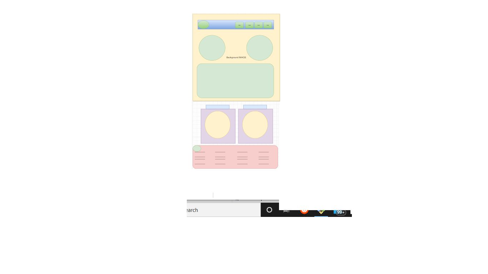

# full-stack-dev
My official portfolio
## Build page following the style guide
* Using a style guide will help me **save time** as I will understand what am creating. 
* Here is my **wireframe**

- Using my intuition to decide on how to implement my style guide. following 
    * Will  use `Rem and %` to help me create a really responsive website where break points will follow industry standards
    * **Accessibility** will be hightly considered.
    * `A css reset` will be used to implement a same cross browser functionality.
    * Wil use Flex and grid to create my responsive design.
    * `@media and screen()` will be used to create my break point.
    * Intend to use this project as a **frontend** while `concurrently` will be used to connect my frontend to my **backend**.
    ## Link to github pages
    [Link](https://tochiskool.github.io/full-stack-dev/)
    * Project will be hosted on `Heroku`